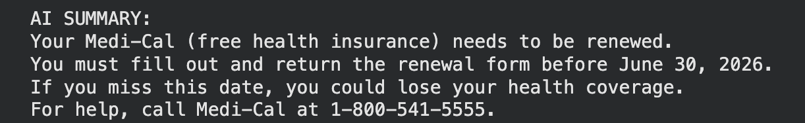
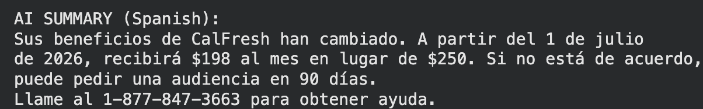
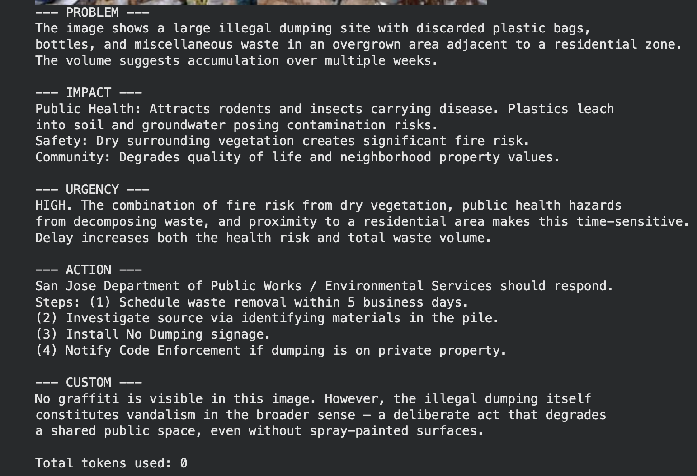
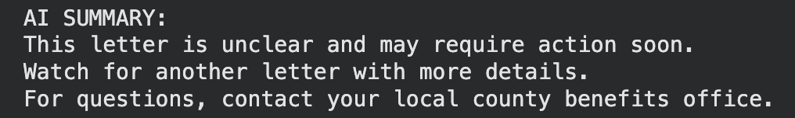

# AI4SG: Multilingual Benefit Access Assistant for East San Jose Seniors

> An AI-powered tool that helps elderly, non-English-speaking residents in San Jose's East Side understand government benefit letters and report neighborhood hazards — without needing to read English or navigate complex government websites.

---

## Problem

Maria Santos is a 72-year-old Vietnamese-speaking grandmother living in East San Jose. She moved to the U.S. eight years ago and has limited English proficiency. Her adult daughter works full-time and can't always translate government documents. When Maria received a letter about a change to her Medi-Cal coverage, she couldn't tell whether it required action, what the deadline was, or who to contact. She did nothing — not because she didn't care, but because the information was inaccessible to her.

This is the exact failure point: **comprehension, not access**. The information exists. The programs exist. But dense, English-only government documents create a wall between eligible seniors and the benefits they qualify for. The same barrier applies to reporting neighborhood hazards — broken infrastructure, illegal dumping, and unsafe conditions near residential areas go unreported because the 311 system requires English literacy and digital navigation skills most elderly residents in this community don't have.

This problem aligns with **SDG 1 (No Poverty)**, **SDG 10 (Reduced Inequalities)**, and **SDG 11 (Sustainable Cities and Communities)**.

---

## AI Capability

This project combines two AI capabilities from the lab sequence:

**Lab 2 — Prompt Engineering (Text Understanding + Multilingual Response)**  
The failure point for government letters is comprehension. A large language model, given the right system prompt, can read a benefit letter, extract the key message and required action, and return a plain-language summary in the resident's language. This directly addresses the moment the system breaks down for Maria: she receives a document she can't parse. The AI turns it into something she can act on.

**Lab 3 — Image Recognition (Multimodal Civic Reporting)**  
The failure point for neighborhood hazard reporting is the reporting process itself — it requires English, digital literacy, and knowledge of the right department to contact. A vision model can analyze a photo of a hazard, identify the problem, assess urgency, and generate a structured report automatically. A resident like Maria can report a problem by taking a photo — nothing more.

Together, these capabilities reduce the English-language and digital literacy requirements for two of the most common interactions between elderly immigrant residents and city/government systems.

---

## Workflow

### Workflow A — Benefit Letter Assistant (Lab 2)

| Step | Detail |
|------|--------|
| **Input** | A government benefit letter (e.g., Medi-Cal renewal notice, CalFresh update) pasted as text |
| **AI step** | System prompt instructs the model to: extract the core message, flag any required action or deadline, and respond in plain language in the resident's language |
| **Output** | A short, plain-language summary: what the letter says, what the resident needs to do, and by when |
| **Who acts** | The resident or caregiver reads the summary and takes the appropriate next step |

**Lab 2 Output — Test 1: Medi-Cal Renewal (English)**

**Lab 2 Output — Test 2: CalFresh Benefit Change (Spanish)**

---

### Workflow B — Neighborhood Hazard Reporter (Lab 3)

| Step | Detail |
|------|--------|
| **Input** | A photo taken by the resident of a neighborhood problem (illegal dumping, broken sidewalk, unsafe conditions) |
| **AI step** | Vision model analyzes the image across four dimensions: problem identification, public health/safety impact, urgency rating (LOW/MEDIUM/HIGH), and recommended city department + action |
| **Output** | A structured civic report ready to route to the appropriate San Jose city department |
| **Who acts** | A city staff member or 311 operator receives the pre-triaged report and initiates the appropriate service response |

**Lab 3 Output — Hazard Analysis**

---

## Failure Case

**Lab 3 revealed a critical limitation: the AI cannot detect problems that look ordinary.**

When the vision model analyzed the illegal dumping image, it correctly identified the waste pile, flagged the fire hazard from surrounding dry vegetation, and rated urgency as HIGH. However, it had no way to know the site was near a residential neighborhood with elderly residents, whether it was a repeat dumping location, or how long the pile had been there. Its urgency assessment was accurate but generic — disconnected from the specific vulnerability of the surrounding community.

More significantly: if a resident photographed a sidewalk that has never had curb cuts for wheelchair users, or a bus stop with no shade in a high-heat corridor, the AI would likely not flag these as problems. These conditions look "normal" to a model trained on data where such gaps were historically accepted and undocumented. **The AI encodes whose problems have been visible enough to be reported — not necessarily whose problems are most urgent.**

**Edge Case Output — Vague Letter with No Clear Action**

The edge case test showed a near-miss: the AI produced a confident summary of a vague letter, telling the resident "no action is needed right now" — which could cause them to disengage at exactly the wrong moment if a termination notice follows weeks later.

---

## Oversight and Tradeoff

**Where human review sits:**

For the benefit letter workflow (Lab 2), automated plain-language summaries are appropriate for routine notices — document confirmations, general reminders, portal redirects. Any message involving a coverage change, eligibility determination, financial hardship flag, or appeal deadline should be reviewed by a multilingual caseworker before the summary is sent. The AI drafts; a human confirms.

For the hazard reporting workflow (Lab 3), automated routing works well for clear, high-confidence visual problems (illegal dumping, graffiti, downed trees). It should not auto-generate work orders for ambiguous situations — reports near unhoused individuals, systemic infrastructure gaps, or anything where community context changes the urgency level.

**The one change — and its tradeoff:**

Adding a multilingual response layer allows the system to respond in the resident's language. The tradeoff: multilingual output increases the risk of mistranslation on high-stakes information (deadlines, eligibility rules, appeal rights). A fluent automated response in Vietnamese or Spanish may feel authoritative even when it's wrong. This means the oversight requirement actually increases with multilingual support — not decreases. A plain-language English summary with a referral to a human translator may be safer for legally consequential notices than a fully automated multilingual response.

---

*Built for AI for Social Good (AI4SG) — San José State University, Spring 2026*
